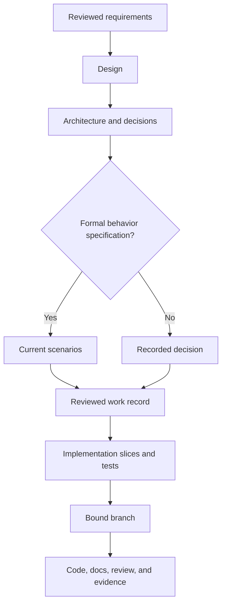

# Design to implementation

A design explains intent, journeys, constraints, system boundaries, and
decisions. It links to requirements and formal specifications without copying
them. Implementation is ready when the following evidence is present or
explicitly judged unnecessary.

Begin with evidence, assumptions, alternatives, and a shaped product outcome.
New products need a smallest useful slice; existing products need observed behavior
and compatibility boundaries. Apply UI/UX exploration only where relevant and
scale documentation and evaluation to the change's scope and risk.

[Back to the workflow map](../development-workflow.md)

| Area | Evidence |
| --- | --- |
| Identity | Work ID, title, owner, status, tracker, and requirements links |
| Outcome | Audience, problem, measurable outcome, scope, and non-goals |
| Journey | Entry point, main path, states, permissions, errors, empty/loading states, and accessibility |
| System | Deployment and module boundaries, interfaces, data ownership, dependencies, and failure behavior |
| Decisions | Alternatives, selected approach, consequences, and linked ADRs |
| Behavior | Acceptance criteria and current formal specification when required |
| Verification | Acceptance, regression, integration, migration, security, and operational tests as applicable |
| Delivery | Incremental slices, compatibility, rollout, observability, recovery, and rollback |
| Traceability | Work record, decisions, specification, branch, PR, and runbooks |

For greenfield work, center the handoff on one deployable boundary and vertical
slice. For brownfield work, begin with current behavior, callers, data,
compatibility promises, characterization tests, and an incremental transition.

If implementation uncovers a material product, interface, security, migration,
or operational choice that the design does not answer, pause and update the
reviewed artifact. Small implementation details may remain in code and tests;
decisions future maintainers need belong in repository documentation.

For projects with tracker and SCM roles, link the reviewed design to the work
record before publication and use `ai-dlc work finish <work-id>` after merge.
Without those roles, keep the same design evidence and test discipline but use
the project's manual lifecycle until the roles are configured.
