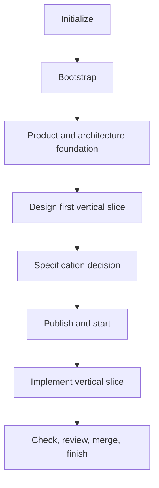

# Greenfield workflow

Use this path for a new deployable application. Start with one application and
one end-to-end user outcome; split deployment only when requirements justify
independent operational ownership.

[Back to the workflow map](../development-workflow.md)

1. Select only the needed provider roles and initialize with the relevant
   preset, for example `ai-dlc project init my-project --preset python --apply`.
2. Run project setup and required checks. Initialized language presets create a
   minimal application and real syntax/compiler check; first setup creates the
   lockfile and later setup remains locked.
3. Record audience, outcome, exclusions, ownership, deployment boundary,
   modules, dependencies, interfaces, and operational assumptions.
4. Design the first vertical slice, including error, empty, loading,
   permission, and accessibility states where relevant.
5. Record the formal specification decision. Make required scenarios current
   through the configured provider or a deliberately used local OpenSpec
   compatibility fallback; otherwise record `requires_spec = false` and its
   reviewed reason.
6. With tracker and SCM configured, review the work record, then publish and
   start it through AI-DLC. Otherwise use local checks and manual tracking until
   those roles are configured.
7. Implement the smallest coherent slice, add acceptance tests, and extend
   required checks as behavior grows.
8. Always run required local checks. With tracker and SCM configured, review
   and merge through SCM and use `ai-dlc work finish <work-id>` to validate the
   merged revision before tracker completion. Otherwise close the manual
   lifecycle without claiming AI-DLC remote completion.

The slice is ready when its user, outcome, design, specification decision, and
test strategy are explicit; configured remote work also requires a reviewed
work record. Local work is done when code and durable documents agree and
required checks pass. With tracker and SCM configured, done additionally means
the PR is merged and finish gates accept the remote evidence.
