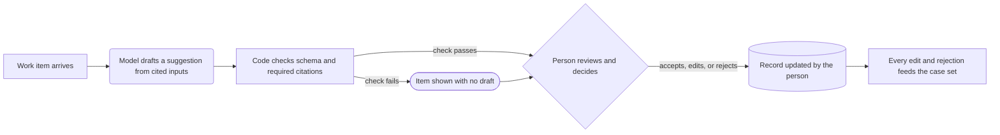
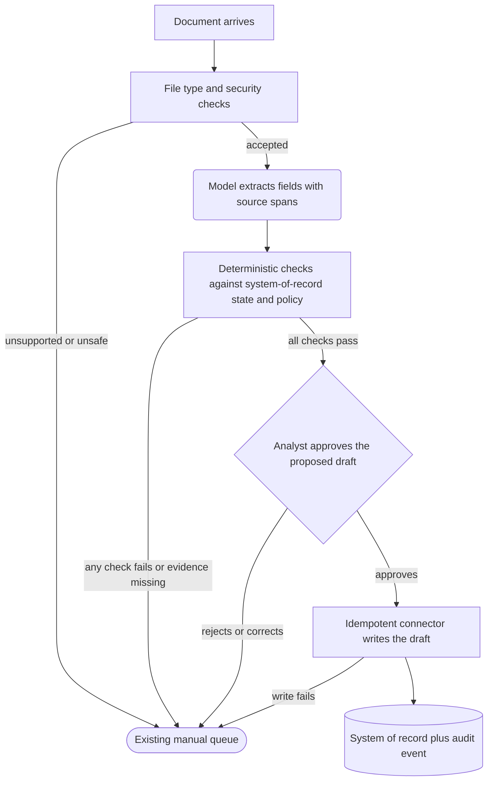
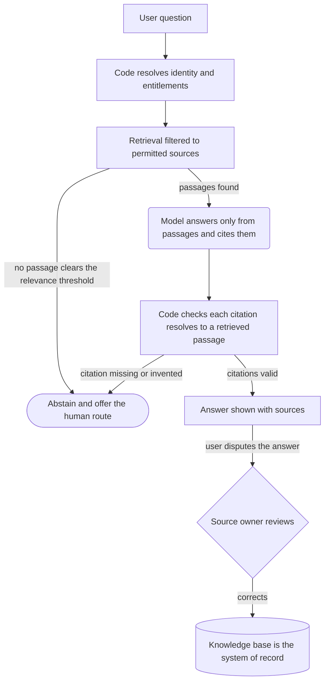
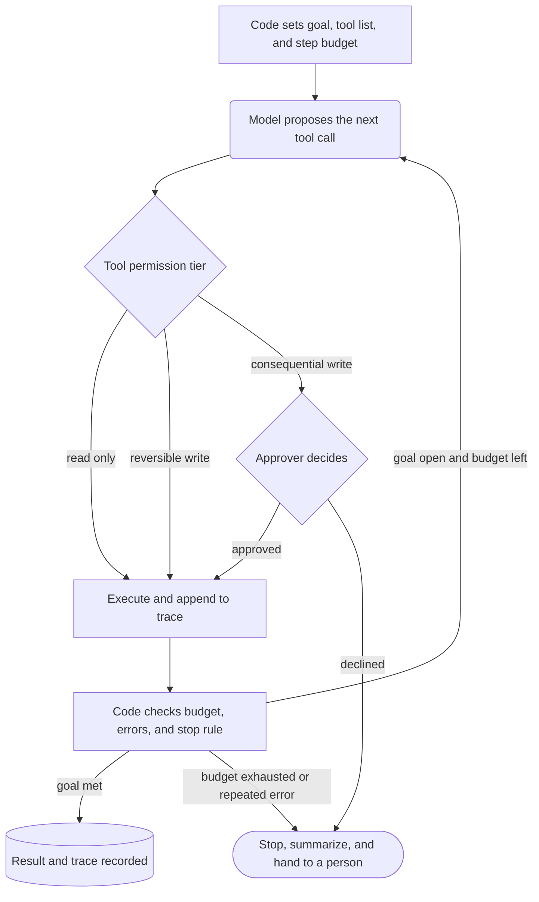
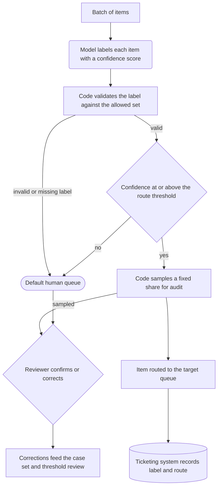

# AI system patterns

A pattern here is a boundary and control shape for placing a large language model (LLM) inside a workflow: where the model sits, which deterministic checks surround it, where a person decides, which system holds authoritative state, and how work returns to a safe state when anything fails. Choose the least autonomous shape that still meets the workflow outcome, then use the [responsibility matrix](../toolkit/responsibility-matrix.md) to decide ownership of each responsibility inside that shape. The pattern is the frame; the matrix is the contract.

The five patterns below cover most enterprise requests an AI forward deployed engineer (FDE) receives. Each diagram uses one convention: rounded boxes are model steps, rectangles are deterministic code, diamonds are human decision points, cylinders are the system of record, and stadium shapes are the safe state. Every numeric rule on this page is a starting heuristic, not an industry standard.

## Assist

The model drafts or suggests; a person decides and performs the action. Nothing the model produces reaches a system of record without a human choosing it. At Northwind Software support (fictional), the model drafts a reply from the ticket and recent history, and the agent edits or discards it before sending.

**Use it when** the action is consequential, the workflow is still being measured, or reviewer time is cheaper than a wrong action. Assist is also the right permanent design when the person's judgment is the product, as in customer-facing writing.

**Do not use it when** volume turns review into rubber-stamping; a draft nobody reads is an unreviewed action. Measure review time and acceptance rate before assuming the person still decides.

### Shape

### Boundary

- The model produces one bounded artifact, such as a draft or a ranked list, and cites the inputs it used.
- Code enforces the output schema, strips anything the person may not see, and renders the draft as provisional.
- People make every decision, act in the system of record, and see the item even when the model produces nothing.

### Evaluation

- Case level: acceptance rate, edit distance between draft and final, and grounding in the cited inputs.
- Workflow level: handling time against baseline, review burden, and whether the person's final output quality changed.
- Automation bias: sample accepted drafts for a second review to confirm the person is still checking.

**Guides:** [Human, software, and AI system design](../skills/ai-system-design.md), [Context engineering and prompt design](../skills/context-engineering.md), [Grader design and error analysis](../skills/eval-engineering.md).

## Extract, validate, act

The model turns an unstructured input into structured fields with evidence, deterministic code validates those fields against authoritative state and policy, a person approves, and code performs the action. This is the LumenPeak Manufacturing shape from the [invoice-intake example](../examples/invoice-intake-ai/README.md): five extracted fields with source spans, enterprise resource planning (ERP) checks for vendor, purchase order, duplicate, tolerance, and permission, analyst approval, then an idempotent draft write.

**Use it when** the input is a document, message, or form; the target is a record in a system of record; and the policy rules already exist in code or can be written as code.

**Do not use it when** the validation rules cannot be stated deterministically or there is no authoritative state to check against. If the model must judge policy, the pattern collapses into an unreviewed decision.

### Shape

### Boundary

- The model interprets only: extract, cite, and report confidence. It never decides and never writes.
- Code owns every validation, permission, threshold, and write. Rules such as the fictional `FIN-AP-07` tolerance live in code with a policy version, not in a prompt.
- People approve every draft until evidence supports a bounded-autonomy gate; Finance Controls owns policy exceptions.

### Evaluation

- Field level: exact match and correct source span on a stratified case set; the example started with 240 cases across common, duplicate, missing purchase order, policy-exception, and low-quality strata.
- Control level: recall of every policy case with zero writes; one miss blocks promotion.
- Workflow level: correction rate, median review time, one-business-day completion, and zero unauthorized writes in production traces.

**Guides:** [Human, software, and AI system design](../skills/ai-system-design.md), [Context engineering and prompt design](../skills/context-engineering.md), [Production readiness for LLM systems](../skills/production-readiness.md), [Evaluation and staged rollout](../skills/evaluation-and-rollout.md).

## Retrieval-grounded assistant

The model answers questions only from passages that code retrieved for this user, cites those passages, and abstains when retrieval finds nothing adequate. At Harbor Mutual (a fictional insurer), claims handlers ask about policy wording and coverage rules; the assistant may only cite the current policy library the handler is entitled to see.

**Use it when** the answer exists in a maintained corpus, the corpus changes faster than a model could be retrained, and the customer needs every answer traceable to a source and filtered by entitlement.

**Do not use it when** the corpus is stale or contradictory and nobody owns it; retrieval will faithfully surface the wrong document. Avoid it when the question needs calculation or transactional state; that is a tool call, not a retrieval.

### Shape

### Boundary

- The model composes an answer from supplied passages and marks what it could not find; it does not decide what the user may see.
- Code applies entitlement filters before retrieval, validates that every citation maps to a retrieved passage, and forces abstention when either check fails. Retrieved text is untrusted content, never instructions.
- People own the corpus, adjudicate disputed answers, and handle questions the assistant declines.

### Evaluation

- Retrieval level, graded separately from generation: recall of the known correct passage at the production cutoff, and zero passages outside the user's entitlement on a permission test set.
- Answer level: faithfulness to the cited passages by a model-graded judge calibrated against human labels, plus the citation-validity check in code.
- Abstention: the share of unanswerable questions where the assistant abstained; a starting target is at least 95% before any cohort sees answers.
- Workflow level: time to resolution and the rate of answers later disputed by the source owner.

**Guides:** [Retrieval and grounding](../skills/retrieval-and-grounding.md), [Context engineering and prompt design](../skills/context-engineering.md), [Grader design and error analysis](../skills/eval-engineering.md), [Production readiness for LLM systems](../skills/production-readiness.md).

## Tool-using agent

The model chooses and sequences tool calls toward a goal inside a loop that code controls with permission tiers, approval points, a step budget, and a full trace. At Cobalt Freight (a fictional logistics broker), an agent investigating a delayed shipment reads tracking and order systems freely, may reschedule a pickup because that is reversible the same day, and needs dispatcher approval before issuing a customer credit.

**Use it when** the path to the outcome varies case by case, the tools exist with clear contracts, and the customer accepts per-tier controls rather than one autonomy switch.

**Do not use it when** the workflow is a fixed sequence; a pipeline with one model step is cheaper, more testable, and easier to explain. Do not use it when a needed tool has no read-only mode or no way to reverse its writes.

### Shape

### Boundary

- The model plans and proposes; every tool call is a request that code validates against the tool's schema and tier before execution.
- Code owns the loop: tier enforcement, argument validation, idempotency keys on writes, the step budget, stop rules, and the trace. A starting budget is 15 steps with a hard stop after three consecutive failed calls.
- People approve consequential-tier actions and receive a readable summary whenever the agent stops early. Tool outputs are untrusted content; an instruction inside a tool result is evidence of injection, not a command.

### Evaluation

- Step level: tool-call validity, argument correctness, and tier compliance, all measurable from traces without a judge.
- Trajectory level: goal completion against expected end states, unnecessary or repeated calls, and correct stops on cases designed to be unsolvable.
- Safety level: zero consequential writes without an approval record, measured on every production trace, not a sample.
- Workflow level: cases resolved per hour, approver burden, and cost and latency per case against budget.

**Guides:** [Designing tool-using agents](../skills/agent-and-tool-design.md), [Human, software, and AI system design](../skills/ai-system-design.md), [Grader design and error analysis](../skills/eval-engineering.md), [Production readiness for LLM systems](../skills/production-readiness.md).

## Batch classification and routing

The model labels each item in a high-volume stream with a confidence score, code routes items above a threshold and sends the rest to a default human queue, a fixed sample of routed items is audited, and corrections feed the case set. Northwind Software support (fictional) triages 40,000 tickets a month by product area and urgency; low-confidence and sampled tickets go to a human triage lead.

**Use it when** volume makes case-by-case review impossible, the label set is fixed and small, and a wrong route is recoverable because the receiving queue can re-route.

**Do not use it when** a wrong label triggers an irreversible or customer-visible action, such as closing a ticket, without a person in between. Route, do not resolve.

### Shape

### Boundary

- The model emits one label from a closed set plus a confidence score; it does not choose the threshold or the audit rate.
- Code validates labels, applies the threshold per label class, draws the audit sample, routes, and records the label version. A starting audit rate is 5% of routed items, with 100% review for any class whose measured precision falls below its target.
- People review the default queue and the audit sample, own the threshold, and decide when a label class is ready for a higher automation share.

### Evaluation

- Label level: precision and recall per class on a stratified case set, and calibration of the confidence score, so that 0.9 means roughly 90% precision.
- Routing level: the share auto-routed at the current threshold and the re-route rate reported by receiving queues.
- Feedback level: lag between a correction and its appearance in the regression set, and week-over-week drift in the class distribution.
- Workflow level: time to first correct owner and default-queue volume against triage capacity.

**Guides:** [Grader design and error analysis](../skills/eval-engineering.md), [Context engineering and prompt design](../skills/context-engineering.md), [Production readiness for LLM systems](../skills/production-readiness.md), [Evaluation and staged rollout](../skills/evaluation-and-rollout.md).

## Comparison

Starting gates use the [rollout plan](../toolkit/rollout-plan.md) ladder: observe, assist, shadow, approve, bounded autonomy.

| Pattern | Typical autonomy gate to start at | Action consequence | Evaluation focus | Most common failure |
| --- | --- | --- | --- | --- |
| Assist | Assist | None until a person acts | Acceptance, edit distance, review burden | Rubber-stamped drafts that nobody reads |
| Extract, validate, act | Shadow, then approve | Record created in a system of record | Field accuracy with evidence, control recall, zero unauthorized writes | Validation rules drifting into the prompt |
| Retrieval-grounded assistant | Assist for a cohort | Advice a person may act on | Retrieval recall, citation validity, abstention, entitlement leaks | Confident answers from stale or unpermitted sources |
| Tool-using agent | Approve for writes, shadow for reads | System changes across several tools | Tier compliance, trajectory completion, approval records | Loops and unbounded cost without a stop rule |
| Batch classification and routing | Approve, then bounded autonomy per class | Work lands in the wrong queue | Per-class precision, calibration, audit corrections | Threshold set once and never revisited |

## Composition

Patterns nest. A tool-using agent at Cobalt Freight may call an extract-validate-act step to file a damage claim from a photo and a retrieval-grounded step to check the carrier contract; a batch router may hand low-confidence items to an assist workflow. Composition multiplies the consequential actions, and each one needs its own responsibility matrix row: named owner, required evidence, permission limit, escalation trigger, and safe failure behavior. Keep one responsibility matrix per consequential action, evaluate each nested pattern at its own level before the composite, and trace the whole path so a reviewer can reconstruct which step produced which change. When a composite cannot show that, split it until each piece can.
