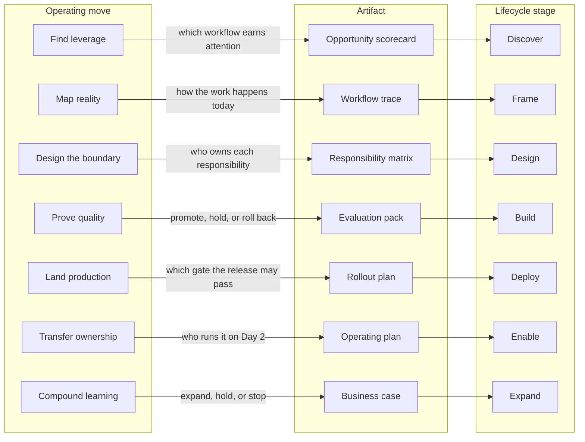

# What is an FDE?

In this repository, a Forward Deployed Engineer is an AI implementation engineer who works alongside customers to turn important operational problems into working, adopted, and governed production outcomes. The role combines technical judgment, customer empathy, delivery discipline, and clear communication.

## Core responsibility

An AI FDE connects a customer’s context to a solution that creates measurable value. That means learning how work happens today, framing the problem precisely, deciding which responsibilities belong to humans, deterministic software, and AI, building and integrating the complete system, proving quality with evaluations, and helping the customer operate it independently.

## What distinguishes the role

AI FDE work is neither detached advisory work nor feature delivery without context. An FDE stays close enough to the customer to test assumptions with evidence, while remaining technical enough to make sound choices about feasibility, model behavior, evaluation, enterprise integration, security, governance, and production readiness.

The role also creates leverage: it turns one engagement’s hard-won lessons into clearer practices, reusable capabilities, and artifacts that help future teams move faster.

## Measures of success

An FDE is successful when the customer has a valuable outcome in use, understands how to sustain it, and can make informed decisions about what to improve next. Useful signals include:

- A shared, evidence-based definition of the problem and desired outcome.
- A solution that works in the customer’s real operating context.
- Adoption by the people who depend on it.
- Clear ownership, operating expectations, and evidence of impact.

## A shared engagement model

The role carries an engagement through [Discover → Frame → Design → Build → Deploy → Enable → Expand](engagement-lifecycle.md). Each stage reduces a different kind of uncertainty; progress comes from validated learning and delivered value, not from completing a prescribed sequence of meetings.

The [AI Implementation Field Playbook](presentations/fde-overview.html) describes the same work as seven operating moves. Each move produces one toolkit artifact, and each artifact is produced in one lifecycle stage; the edge labels name the decision the artifact records.

The artifacts are the [toolkit](../toolkit/README.md); the moves are taught by the [skill guides](../skills/README.md); the [invoice-intake example](../examples/invoice-intake-ai/README.md) shows all seven completed in one engagement.
