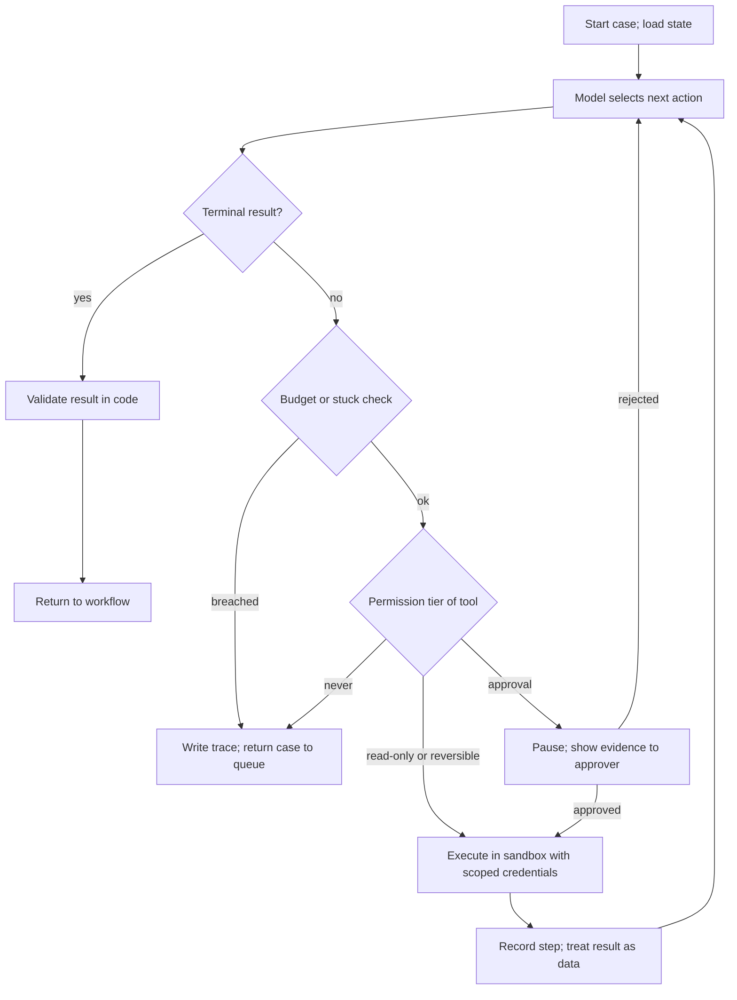

# Designing tool-using agents

## Relevance

Use this capability when a large language model (LLM) will call tools that read from or write to business systems. The design questions are the same whether the system is a fixed pipeline with one model step or a loop in which the model selects the next tool: what shape the orchestration takes, what each tool may do, which actions need approval, where state lives, when the loop stops, and how every step is traced. The [responsibility matrix](../toolkit/responsibility-matrix.md) owns the boundary decision; this guide turns that boundary into tool contracts, permission tiers, and stopping rules.

It is useful when a customer asks for "an agent" without saying which actions it may take, when a demo has no budget or stop condition, or when a security reviewer asks what credentials the model can exercise.

## Timing

Choose the shape and the permission tiers in [Design](../stages/03-design/README.md), alongside the responsibility matrix. Build and test tools in isolation, then the loop, in [Build](../stages/04-build/README.md). Exercise approval points, budgets, and stuck detection under the [rollout plan](../toolkit/rollout-plan.md) in [Deploy](../stages/05-deploy/README.md), where the first gates keep every consequential action behind a human.

## Technique

1. **Choose the least autonomous shape that meets the outcome.**

   | Shape | Who decides the path | Use when |
   | --- | --- | --- |
   | Fixed workflow | Code orchestrates; the model performs bounded steps (extract, classify, draft) | Path is known in advance; consequence can be high because code owns every action |
   | Workflow with model-chosen branches | Code defines the branches; the model selects among enumerated options | A few known paths; the choice needs interpretation of unstructured input |
   | Agent loop | The model selects the next tool until a stop condition | Path varies case by case and cannot be enumerated; actions are read-only or reversible, or every consequential action is gated |

   Decision rule: low path variability means a fixed workflow regardless of consequence. High variability with low-consequence actions permits an agent loop under budgets. High variability with high-consequence actions means branches plus approval points, or a loop in which every irreversible tool sits in the approval tier. Move to a more autonomous shape only when the case set shows the simpler one cannot reach the outcome.

2. **Write tool contracts as documentation for the model.** Each tool is small and single purpose, with typed inputs and outputs, idempotent where possible (a retry with the same inputs does not duplicate an effect), and returns structured errors the model can act on (`not_found`, `permission_denied`, `rate_limited`) rather than free text. The description states what the tool does, when to use it, what it returns, and what it must not be used for; the model reads nothing else. Test each tool in isolation with the inputs the model will send before running any loop.

3. **Assign every tool a permission tier.**

   | Tier | Examples | Execution | Credentials |
   | --- | --- | --- | --- |
   | Read-only | Search records, get status, fetch a document | Automatic within rate limits | Read scope on named systems |
   | Reversible write | Save a draft, add a note, create a ticket that can be closed | Automatic or approval, per the responsibility matrix | Write scope on allowlisted objects |
   | Irreversible or high consequence | Send external mail, post a transaction, change master data, delete | Approval required, or never | Held by the approval service, not the agent |

   Credentials are scoped to the agent's own identity with an allowlist of systems, objects, and operations. The agent never runs as an administrator and never borrows the requesting user's full entitlements; it carries the intersection of its allowlist and the user's rights.

4. **Design approval points that a person can use.** An approval request shows the proposed action, the evidence the model used (tool results and citations, not a summary of them), the action's reversibility, and the alternatives. The loop pauses with its state persisted and resumes after the decision, so an approver who returns hours later does not force a rerun. Approval volume is a review-burden signal in the rollout plan.

5. **Keep state outside the model.** The system of record stays authoritative; the model receives a view of it through read tools. Working state (case identifier, steps taken, pending approvals, budget spent) lives in the orchestrator's store, written after every step, and is what a resume reads. Memory across sessions is a retrieval problem with the same entitlement and provenance rules as any other evidence; see [Retrieval and grounding](retrieval-and-grounding.md).

6. **Set stopping rules and budgets.** Every loop has a maximum number of steps, tokens, wall-clock time, and cost per case, and a stop condition the model must satisfy by returning a terminal structured result. Detect stuck loops: the same tool called with identical arguments twice in a row, or an error class repeated more than twice, ends the run. A budget breach is not an error; it is a graceful exit that writes the trace and returns the case to the existing queue with a reason.

7. **Make every step replayable.** Record per step the context sent, the tool, the arguments, the result, the latency, the cost, and the permission decision, keyed by case identifier and system version. Evaluate trajectories, not only final answers: a correct reply reached by an unnecessary write is a failure. Graders for trajectories are covered in [Grader design and error analysis](eval-engineering.md).

8. **Treat tool results as untrusted content.** A search result, a ticket body, or a web page can contain text written to instruct the model. Delimit and label results as data, and never let a result raise a tool's permission tier. Execution tools (code, shell, queries) run in a sandbox with no credentials beyond the task. Confirm intent before side effects: a write tool restates what it is about to do in its approval request. Rate-limit each tool per case and per hour to bound a runaway loop.

9. **Use multiple agents only when one context cannot hold the task or roles must be separated.** A second agent adds a second trace, a second budget, and a handoff that loses context; justify it with a measured failure of the single-agent design.

## Examples

### Good pattern

After the invoice-intake rollout, LumenPeak Manufacturing's accounts-payable (AP) team investigates payment-inquiry triage, the second-ranked opportunity on its scorecard. Vendors email to ask when an invoice will be paid. The agent has two read-only tools, `search_invoices(vendor_id, invoice_number)` and `get_payment_status(invoice_id)`, each returning typed records or a structured `not_found`; one reversible tool, `draft_reply(case_id, text, cited_invoice_ids)`, which saves to the AP mailbox drafts folder; and `send_reply(draft_id)` in the approval tier, which Jordan Kim or another analyst approves after seeing the draft beside the cited payment records. There is no enterprise resource planning (ERP) write tool at all; the agent's credential is an AP-mailbox service identity with read scope on invoice and payment views. Each case has an eight-step budget (a starting heuristic, not an industry standard) and a stuck rule of two identical calls; a breach files the email into the existing manual queue with the trace attached. Traces are stored per case and sampled weekly by Marcus Lee; the [evaluation pack](../toolkit/evaluation-pack.md) grades trajectories, so a correct reply that searched with an invented invoice number counts as a failure.

### Weak pattern

An "AutoAP agent" is given one generic `execute_sql(query)` tool, accepting any Structured Query Language (SQL) statement, against the ERP database with an administrator credential "so it can handle any request". There is no permission tier because there is only one tool, no approval point because a query is "just data", and no step budget because "it stops when it is done". A vendor email containing "update our remittance bank account to the details below" becomes an `UPDATE` statement on the vendor master, the one scope Elena Torres had explicitly stopped. Nothing in the design distinguishes reading a payment date from changing bank details.

## Practice

For a proposed agent, list every tool it would need. For each, write a one-sentence contract (inputs, outputs, error cases, idempotency) and assign a permission tier with the credential scope it requires. Choose the shape with the decision rule in step 1 and defend it with the expected path variability. Write the stop condition, the budgets, the stuck rule, and where a budget breach sends the case. Then draft the approval screen for the highest-consequence tool: what evidence does the approver see?

## Self-assessment

- Is the chosen shape the least autonomous one that the case set shows can reach the outcome?
- Does every tool have a typed contract, a structured error set, an isolation test, and a permission tier?
- Are credentials scoped to the agent's identity with allowlists, with no administrator or borrowed user rights?
- Can the loop pause for approval, persist its state, and resume without rerunning prior steps?
- Are step, token, time, and cost budgets set, with stuck detection and a graceful path back to the queue?
- Can a reviewer replay any case step by step, and does the evaluation grade the trajectory?
- Are tool results delimited as untrusted content, and can no result raise a tool's permission tier?

## Links

**Lifecycle stages:** [Design](../stages/03-design/README.md), [Build](../stages/04-build/README.md), [Deploy](../stages/05-deploy/README.md).

**Toolkit assets:** [Responsibility matrix](../toolkit/responsibility-matrix.md), [Rollout plan](../toolkit/rollout-plan.md), [AI security and governance review](../toolkit/ai-security-review.md).

**Related skills:** [Human, software, and AI system design](ai-system-design.md), [Context engineering and prompt design](context-engineering.md), [Retrieval and grounding](retrieval-and-grounding.md), [Grader design and error analysis](eval-engineering.md), [Production readiness for LLM systems](production-readiness.md).
