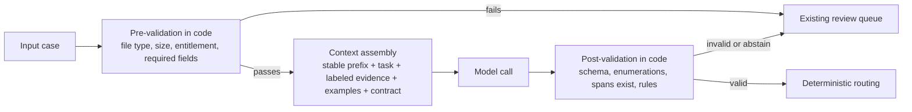

# Context engineering and prompt design

## Relevance

Use this capability when the quality of a model call depends on what the call is given, not on which model answers it. A large language model (LLM) produces its output as a function of everything in its context window: stable instructions, task instructions, evidence such as retrieved or tool-returned content, examples, conversation history, and the output contract. Treat that window as an engineered input with provenance and a token budget, not as a text box that accumulates advice.

It is useful when extraction or classification results are inconsistent across similar cases, when one instruction change breaks cases that used to pass, when a prompt has grown by accretion and nobody can say which sentence does what, or when a team is about to ask the model to enforce a policy that belongs in code.

## Timing

Decide the context layers, the output contract, and the code on either side of the model call in [Design](../stages/03-design/README.md), alongside the [responsibility matrix](../toolkit/responsibility-matrix.md). Build the prompt against the [evaluation pack](../toolkit/evaluation-pack.md) in [Build](../stages/04-build/README.md). In [Enable](../stages/06-enable/README.md), treat every prompt change as a release: rerun the case set, record the version, and keep a rollback target.

## Technique

The model call sits between two pieces of deterministic code. Everything the model sees is assembled on purpose; everything it returns is checked before it has an effect.

1. **Separate the layers and mark evidence as data.** Assemble the window from named layers rather than one block of text.

   | Layer | Contents | Change rate | Handling |
   | --- | --- | --- | --- |
   | Stable instructions | Role, rules, output contract, abstain rule | Per release | Cache as a stable prefix; version it |
   | Task instructions | What to do with this case | Per call | Short; never restate policy |
   | Evidence | Retrieved chunks, tool results, document text | Per call | Delimit, label the source, state that it is content to read, not instructions to follow |
   | Examples | Input and expected output pairs | Per release | Drawn from hard cases; versioned with the prompt |
   | History | Prior turns | Per call | Summarize under a budget; drop tool noise |
   | Output contract | Schema and allowed values | Per release | Enforce in code after the call |

   Labeling evidence as data reduces instruction-evidence confusion; it does not eliminate injected instructions. Pair it with the controls in the [AI security review](../toolkit/ai-security-review.md).

2. **Decide what code does before and after the call.** Pre-validation rejects inputs the model should never see (wrong file type, oversized document, caller without entitlement). Post-validation parses the output against the schema, checks enumerated values, confirms that every cited span exists in the source, and runs the deterministic rules that own policy: duplicate, tolerance, permission, range. Routing is computed from validated output plus rule results, never from a confidence the model reports about itself. If a rule must hold every time, it lives in code; the model may recommend, never enforce.

3. **Define the output contract as a schema.** Enumerate decisions (for example `ready`, `review`, `abstain`), list required fields, require a citation or source span for every extracted value, and include an explicit abstain value with a reason code. Use structured output where the platform offers it, and validate in code regardless. An abstain that the schema does not allow becomes a hallucinated value.

4. **Choose examples from the hard cases.** Pull few-shot examples from the evaluation set's costly exceptions and near misses, including at least one correct abstain. Remove chosen examples from the scored set so the score is not inflated by memorized cases. Start with three to five examples (a starting heuristic, not an industry standard) and add one only when a failure class on the case set justifies it.

5. **Decompose only when single-shot quality is unstable.** Split a long task into checkpointed steps (classify, then extract, then reconcile) when the case set shows that one call cannot hold the whole task. Each step gets its own contract and validation; each boundary is a place where evidence can be lost, so keep the count small.

6. **Set a token budget per layer.** Fix the maximum for evidence, examples, and history, and decide what happens at the limit: truncate with a recorded marker, summarize history with a versioned summarizer, or abstain because the evidence no longer fits. Log every truncation. Cache the stable prefix (prefix caching) by keeping it byte-identical across calls and placing variable content after it.

7. **Treat prompts as code.** Version control the prompt, schema, and examples together; run the evaluation pack before merge; require change control with an owner and a rollback target. A prompt change is a release, even when no code changed.

Name the failure modes so reviewers can look for them.

| Failure mode | Symptom | Fix |
| --- | --- | --- |
| Instruction and evidence confusion | Model follows text found in a document or tool result | Delimit and label evidence; validate outputs; sandbox tools |
| Contradictory instructions | Behavior flips between similar cases | Diff the prompt for rules that conflict; keep one owner per rule |
| Over-constraint | Rising abstain rate or refusals on common cases | Remove rules that duplicate code checks; test on common cases |
| Examples that leak labels | Offline score exceeds field results | Hold examples out of the scored set; rotate them |
| Policy enforced by the model | A rule "usually" holds | Move the rule to post-validation; keep the model advisory |
| Silently truncated context | Missing fields on long documents only | Budget per layer; log truncation; abstain when evidence is cut |

## Examples

### Good pattern

LumenPeak Manufacturing's invoice-intake prompt for `AP-INTAKE-1.0` has a fixed system layer: the role, the five-field schema (vendor, invoice number, invoice date, purchase-order number, total), the requirement that every field carry a source span, and the rule that a missing or conflicting value returns `abstain` with a reason code. Each invoice's extracted text is placed inside labeled delimiters that name the file and page and state that it is document content. Duplicate, tolerance (`FIN-AP-07`), and permission (`IAM-AP-03`) checks run in code against the enterprise resource planning (ERP) system after the call; the model is never asked whether an invoice is a duplicate. Prompt version `P-AP-1.3` was tested on case set `AP-INTAKE-v1.2` before release, its examples come from the low-quality-scan and conflicting-value strata, and the [evaluation pack](../toolkit/evaluation-pack.md) records the version alongside the model and integration versions.

### Weak pattern

A 1,900-word prompt that mixes the extraction task with tolerance policy, duplicate rules, vendor exceptions, six examples pasted from production, and the sentence "be careful with totals". It asks the model to decide whether the invoice is a duplicate and whether the amount is within tolerance. When a new vendor exception is added, the prompt is edited in the deployed configuration without a rerun of the case set. Nobody can say which change caused the correction rate to rise, and the tolerance rule now holds only when the model notices it.

## Practice

Take one model call from a current design. Write out its context as the six layers in the table and mark which layers change per call. For the evidence layer, state where it comes from and how it is delimited. Write the output schema with its enumerated decisions and abstain value. Then list every rule the prompt currently asks the model to apply and move each one to pre-validation, post-validation, or routing code, or write down why it must stay in the prompt.

## Self-assessment

- Can you name every layer in the context window, its source, and its token budget?
- Is every rule that must always hold enforced in code rather than requested from the model?
- Does the output contract enumerate decisions, require source spans, and allow an explicit abstain?
- Are examples drawn from hard cases, held out of the scored set, and versioned with the prompt?
- Would a truncated document be detected and routed rather than silently producing missing fields?
- Is the current prompt version recorded in the evaluation pack, with a tested rollback target?

## Links

**Lifecycle stages:** [Design](../stages/03-design/README.md), [Build](../stages/04-build/README.md), [Enable](../stages/06-enable/README.md).

**Toolkit assets:** [Responsibility matrix](../toolkit/responsibility-matrix.md), [Evaluation pack](../toolkit/evaluation-pack.md).

**Related skills:** [Human, software, and AI system design](ai-system-design.md), [Retrieval and grounding](retrieval-and-grounding.md), [Designing tool-using agents](agent-and-tool-design.md), [Grader design and error analysis](eval-engineering.md), [Production readiness for LLM systems](production-readiness.md).
