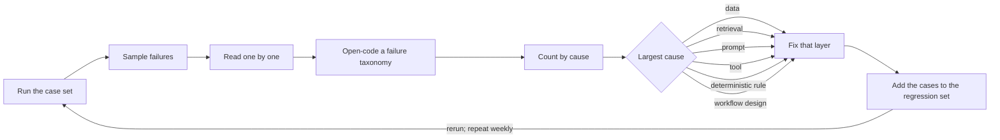

# Grader design and error analysis

## Relevance

Use this capability to construct the evidence that [Evaluation and staged rollout](evaluation-and-rollout.md) consumes at each gate. That guide decides what evidence permits promotion; this one teaches how to build a case set from real work, choose and calibrate graders, report results with uncertainty, and run the error-analysis loop that turns failures into fixes and regression cases. The central habit is to look at the data: read real traces, read failures one by one, and let what you read drive the case set, the rubric, and the next fix. It applies to any large language model (LLM) system whose output a person or a downstream system relies on.

## Timing

Choose the unit of evaluation and assemble the first case set in [Design](../stages/03-design/README.md), once the workflow trace shows which decisions the system affects. Build graders, calibrate judges, and run the loop through [Build](../stages/04-build/README.md). Use the same case set as the promotion gate in [Deploy](../stages/05-deploy/README.md), where shadow mode links offline results to live behavior. Keep the loop running weekly in [Enable](../stages/06-enable/README.md) so production failures become regression cases before they become incidents.

## Technique

### 1. Choose the unit of evaluation to match the decision

| Unit | What is graded | The business decision it informs |
| --- | --- | --- |
| Single response | One input, one output | Is the field, answer, or classification correct? |
| Trajectory or trace | Retrievals, tool calls, and intermediate outputs in sequence | Did the agent take a permitted, efficient path? |
| End-to-end workflow outcome | The record or queue state after humans and controls acted | Did the workflow produce the promised outcome? |

Grade the unit the decision owner cares about. A correct field reached through a forbidden tool call fails at the trajectory level; a clean trajectory that leaves the invoice in the wrong queue fails at the workflow level. Most systems need one grader at each of the response and workflow levels.

### 2. Build the case set from real work

1. Pull cases from production traces, logs, review queues, and the workflow trace. Never author cases from the few-shot examples in the prompt; the system has already seen them.
2. Stratify by workflow segment (document type, channel, customer tier) and by exception type (duplicate, missing reference, policy exception, conflicting evidence). Add adversarial cases (instructions embedded in inputs, malformed files, out-of-scope requests) and valid-abstain cases where the correct output is escalation or "cannot determine".
3. Record the expected outcome, required evidence, and permitted human involvement for each case, as the [evaluation pack](../toolkit/evaluation-pack.md) template asks.
4. Version the set with an immutable identifier. Hold out a slice that nobody tunes against and report its results separately.
5. Size it by reading, not by formula. As a starting heuristic, not an industry standard: read 50 to 100 cases by hand before writing any grader, grow the set to hundreds as failures accumulate, and keep roughly 30 cases per stratum so that a per-stratum rate means something.

### 3. Pick the cheapest valid grader

| Grader type | Examples | Cost | Valid when |
| --- | --- | --- | --- |
| Deterministic | Exact match, schema validity, rule outcome, citation existence, numeric tolerance | Lowest; reruns are free | The answer is a fixed value or a checkable property |
| Programmatic assertion on the trace | Required tool call present, forbidden action absent, step budget respected | Low | The property lives in the trajectory, not the final text |
| Human rubric label | A reviewer scores against a rubric with anchored levels | High; does not scale | The judgment is nuanced, and to calibrate every other grader |
| Model-graded judge | Pairwise preference or rubric score from a model | Medium | Agreement with human labels is measured and reported |

Start at the top of the table; a schema check or rule outcome beats a judge whenever it applies. Reserve a judge for properties no deterministic check captures, such as "the cited span supports the value".

### 4. Calibrate a model-graded judge against people

1. Label a sample by hand: 100 to 200 cases, stratified like the case set, with two labelers wherever the rubric is new (starting heuristic).
2. Measure agreement two ways: a simple agreement rate and a chance-corrected statistic such as Cohen's kappa. A judge that always says "pass" agrees with people most of the time on a mostly-passing set.
3. Read every disagreement. Decide whether the rubric was ambiguous, the human was wrong, or the judge was wrong. Refine the rubric and relabel.
4. Correct known judge biases: length and verbosity (longer outputs score higher), position (the first item in a pair wins), and self-preference (a judge favors its own model family). Swap pair order and average, grade against a fixed reference rather than raw preference, and never let a judge grade outputs from its own model family without measuring agreement first.
5. Report judge agreement beside every judge-produced metric. "Grounding 96 percent (judge; kappa 0.81 against 150 human labels)" is evidence; "grounding 96 percent" is not.

### 5. Report metrics with uncertainty

- Report per-stratum rates, never one aggregate number; the aggregate hides that the policy-exception stratum failed.
- Attach a bootstrap confidence interval to every rate and every difference between versions.
- State the minimum detectable difference for the set size before comparing versions; a 200-case set cannot resolve a one-point change.
- Compare versions on the same case set with the same grader version. Fix thresholds before the run.

### 6. Run the error-analysis loop

Read failures before classifying them: let the taxonomy come from the traces (open coding), then count. Fix the largest cause first in whichever layer it lives; a prompt change is rarely the fix for a retrieval or data problem. Every fix adds the cases that motivated it to the regression set, which reruns before the fix ships. The taxonomy counts over time are the most honest record of what the system does wrong.

### 7. Link online signals to offline results

Correction rate, escalations, user edits, abstain rate, and latency are the online mirror of the offline graders. Before autonomy increases, run shadow mode: process live cases without effect, grade them with the same graders, and confirm that field rates match offline rates within the confidence interval. A gap means the case set does not represent production; fix the set, not the threshold.

### 8. Recognize the anti-patterns

| Anti-pattern | Why it fails |
| --- | --- |
| Public benchmark scores as evidence | Measures a different task on different data |
| Evaluating on few-shot examples | Grades cases the prompt already contains |
| Judge-only metrics | Unknown agreement with people; inherits judge biases |
| Moving thresholds after seeing results | Turns evidence into a decision already made |
| Demos as evidence | One selected case; no strata, no uncertainty |

## Examples

### Good pattern

In the fictional LumenPeak Manufacturing engagement, case set `AP-INTAKE-v1.2` held 240 invoices drawn from the ERP and mailbox sample, stratified into common, duplicate, missing-PO, policy-exception, and low-quality strata, with a held-out slice in each. Fields and controls used deterministic graders: exact match on five fields, ERP rule outcomes, and zero unauthorized writes. "The cited span supports the value" used a rubric judge calibrated on 150 pairs labeled by Jordan Kim and a second analyst at 94 percent agreement (kappa 0.83; fictional figures), with pair order swapped and the agreement printed beside the grounding rate in the evaluation pack. Weekly failure reading during Build found 11 of 19 field failures clustered on skewed or low-resolution scans. The fix was an image preprocessing step before extraction, not a prompt change. The 11 cases entered `AP-INTAKE-v1.3` as regression cases, and the rerun on the same set showed the low-quality stratum inside its threshold.

### Weak pattern

A team reports "91 percent on our test set" for a contract-clause extractor. The set is 40 cases copied from the few-shot examples in the prompt, the grade comes from a model judge nobody has compared with a human label, there are no strata and no interval, and the 90 percent threshold was chosen after the run. The number cannot say which clause types fail, whether the judge agrees with lawyers, or whether a one-point change is noise.

## Practice

Take one traced workflow and choose the unit of evaluation for its release decision. Pull 20 real cases from logs and label them by hand with expected outcome, evidence, and permitted abstention. For each property, name the cheapest valid grader and say why a cheaper one is not valid. Pick one property that needs a judge, write a one-page rubric, label the 20 cases with a colleague, compute the agreement rate, then read every disagreement and rewrite the rubric.

## Self-assessment

- Was the case set drawn from real traces, stratified by segment and exception type, versioned, and partly held out?
- Does the unit of evaluation match the decision the release owner will make?
- Does every judge-produced metric carry its agreement with human labels, with judge biases corrected?
- Are results reported per stratum with confidence intervals and a stated minimum detectable difference, on the same case set across versions?
- Has the team read failures one by one this week, counted causes, fixed the largest, and added the cases to the regression set?

## Links

**Lifecycle stages:** [Design](../stages/03-design/README.md), [Build](../stages/04-build/README.md), [Deploy](../stages/05-deploy/README.md), [Enable](../stages/06-enable/README.md).

**Toolkit assets:** [Evaluation pack](../toolkit/evaluation-pack.md), [Field report](../toolkit/field-report.md).

**Related skills:** [Evaluation and staged rollout](evaluation-and-rollout.md), [Retrieval and grounding](retrieval-and-grounding.md), [Production readiness for LLM systems](production-readiness.md).
