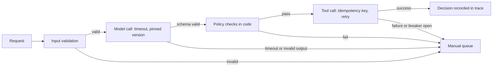

# Production readiness for LLM systems

## Relevance

Use this capability to decide whether a large language model (LLM) system can be operated, changed, and recovered by the customer team after the pilot. [Human, software, and AI system design](ai-system-design.md) sets the boundary and [Evaluation and staged rollout](evaluation-and-rollout.md) sets the evidence gates; this guide covers the engineering that keeps the system inside that boundary under load, change, and failure: tracing, change control, model lifecycle, resilience, deterministic guardrails, cost and latency budgets, drift monitoring, and incident response. It applies to any workflow with a model call in the production path.

## Timing

Build tracing, versioning, and guardrail layers in [Build](../stages/04-build/README.md); they are cheaper to add than to retrofit, and the evaluation pack needs the traces. Prove resilience, budgets, and the kill switch before the Approve gate in [Deploy](../stages/05-deploy/README.md), where the readiness checklist below is entry evidence. Transfer thresholds, owners, and the incident runbook to the customer team in [Enable](../stages/06-enable/README.md) through the operating plan.

## Technique

### 1. Trace every request

Each request records the prompt version, model version, inputs redacted per the customer's data policy, retrieved evidence (record identifiers and spans), every tool call with arguments and result, the output, latency, cost, and the decision the workflow took (draft, abstain, escalate, act). Agree a retention policy with the risk owner: how long, where, who may read, and what is redacted before storage. Sample traces for human review on a schedule; as a starting heuristic, not an industry standard, read 20 traces per workflow per week plus every abstention and correction, and route findings into the error-analysis loop in [Grader design and error analysis](eval-engineering.md). A trace that cannot reproduce the request is not a trace.

### 2. Version everything and control change

Prompt, model, retrieval index, tool set, and policy each carry a version identifier, and the trace records all five. A change to any of them is a release: rerun the [evaluation pack](../toolkit/evaluation-pack.md) on the same case set, obtain the named approval recorded in the [operating plan](../toolkit/operating-plan.md), and record a rollback target before the change reaches production. Store prompts and policies in source control with review, not in a console.

### 3. Manage the model lifecycle

Providers retire models and move default aliases. Pin an explicit model version in configuration and never call a floating alias in production. Plan each migration as a release: run the candidate on the same case set, compare per stratum with confidence intervals, and promote through the rollout gates. Never auto-upgrade in production; a silent model change is an unevaluated release. Track the pinned version's retirement date as an operating signal with an owner.

### 4. Build resilience into the call path

- Timeouts on every model and tool call, set from the latency budget, with a defined result on expiry.
- Retries only with idempotency keys on any call with a side effect, so a retried write cannot create a second draft.
- Rate limits and queueing at the workflow boundary; backpressure rather than dropped work.
- Provider outage falls back to the manual queue, never silently to a different model; a different model is a different system that has not passed the evaluation pack.
- Circuit breakers open on an error-rate or latency threshold and route work to the manual path; closing one is a decision with an owner.

### 5. Guardrails are deterministic layers, not prompt requests

A sentence in the prompt asking the model to behave is a request, not a control. A guardrail is code that runs whether or not the model complied.

| Layer | Mechanism | Example |
| --- | --- | --- |
| Input validation | File type, size, schema, and source allowlist checked before any model call | Reject an executable attachment or an unknown mailbox |
| Output schema validation | Structured output validated against a schema; invalid output abstains | A malformed total routes the invoice to review |
| Policy checks in code | Tolerance, permission, and segregation-of-duties rules evaluated deterministically | The ERP tolerance rule blocks a draft whatever the model proposed |
| Content filtering | Applied on input and output where policy requires it | Block prohibited categories before they reach a user |
| Personal-data handling | Redaction before the model call; classification-aware retention | Mask bank details in traces and prompts |
| Injection defenses | Retrieved and tool-returned content treated as data, never instructions; tool allowlist per step; human approval for consequential actions | Text inside an invoice PDF cannot change the tool set |

Document these layers in the [AI security and governance review](../toolkit/ai-security-review.md) before the customer's security team asks.

### 6. Budget cost and latency

Set a per-request budget in tokens, tool calls, and seconds, enforced in code. Place stable context (instructions, schemas, reference documents) first so prefix caching applies to it. Move non-interactive work to batch processing. Route by task: a classification step does not need the model used for extraction, and each route passes its own evaluation. Report spend per workflow unit, such as cost per invoice, against the business-case ceiling rather than as a monthly total.

### 7. Monitor drift with named owners

Input distribution shifts (document length, vendor mix, language, scan quality) precede quality drops, so track them beside quality proxies: correction rate, abstain rate, escalation rate, and edit distance between draft and final. Each signal has a baseline, threshold, check cadence, named owner, and first response, recorded in the [rollout plan](../toolkit/rollout-plan.md) during Deploy and carried into the operating plan for Enable. A threshold without an owner is a dashboard, not monitoring.

### 8. Prepare incident response

Rehearse and time the kill switch before consequential actions are enabled. Confirm the manual fallback is a path the team has run, not a diagram. On an incident, preserve evidence first: freeze traces, inputs, outputs, and tool results before remediation touches them. Every postmortem produces regression cases for the evaluation pack, which reruns before the remediation ships.

### 9. Readiness checklist

| Area | Question | Evidence |
| --- | --- | --- |
| Tracing | Can any request be reproduced from its trace, and who may read it? | Sample trace with all fields; retention policy signed by the risk owner |
| Versioning | Are prompt, model, index, tool set, and policy versioned per request? | Version identifiers in the trace; change-control entry in the operating plan |
| Model lifecycle | Is the model version pinned and its retirement date tracked? | Configuration; operating signal with owner |
| Resilience | What happens on timeout, retry, rate limit, and provider outage? | Fault-injection results; manual-queue fallback observed |
| Guardrails | Which controls run in code regardless of model behavior? | Security review; a test per layer |
| Cost and latency | What is the budget per request and per workflow unit, and where is it enforced? | Budget configuration; cost per unit in the pilot report |
| Drift | Which input and quality signals have thresholds and owners? | Rollout and operating plan signal tables |
| Incident response | How fast is the kill switch, and where does evidence go? | Timed rehearsal record; runbook |

## Examples

### Good pattern

In the fictional LumenPeak Manufacturing engagement, `AP-INTAKE-1.0` pinned explicit model and prompt versions and recorded both in every trace beside the ERP evidence, tool results, and the analyst's decision. Connector writes carried idempotency keys, so a retry after a timeout could not create a duplicate draft. Tool success below 99 percent in any rolling one-hour window disabled the connector and routed work to the mailbox queue; Priya Nair owned that trigger and its reset. The kill-switch rehearsal on 2026-03-12 completed in seven minutes with no lost case and preserved the trace before restoring state. Cost was tracked per eligible invoice against a $1.05 ceiling; the pilot's $0.88 became an operating signal owned by Elena Torres.

### Weak pattern

A pilot at Harbor Mutual, a fictional insurer, drafts claim acknowledgments by calling the provider's default model alias, so the model changed twice during the pilot without anyone rerunning the case set. Retries have no idempotency keys, and after a timeout burst 40 claimants received two acknowledgments. Full claim files, including bank details, are logged to a shared chat channel for debugging. No rollback target exists; the proposed fallback is "turn it off", but nobody has tested whether the manual queue still receives the work.

## Practice

Take one workflow with a model call in the production path. Write the trace record for one request as it would be stored and check it against step 1. List the five version identifiers and where each is recorded. Inject three faults in a test environment (provider timeout, invalid output schema, tool failure on a write) and record where each request ended up. Fill in the readiness checklist with real evidence or the name of the person who will produce it.

## Self-assessment

- Can any production request be reproduced from its trace, with inputs redacted per the agreed policy?
- Are prompt, model, retrieval index, tool set, and policy versioned, and does every change rerun the evaluation pack with a named approval and a rollback target?
- Does a provider outage or a failed guardrail send work to the manual queue rather than to an unevaluated model?
- Does every guardrail run in code regardless of model behavior, and is that documented for security review?
- Do drift and cost signals have thresholds and named owners, and has the kill switch been rehearsed and timed?

## Links

**Lifecycle stages:** [Build](../stages/04-build/README.md), [Deploy](../stages/05-deploy/README.md), [Enable](../stages/06-enable/README.md).

**Toolkit assets:** [Operating plan](../toolkit/operating-plan.md), [Rollout plan](../toolkit/rollout-plan.md), [Evaluation pack](../toolkit/evaluation-pack.md), [AI security and governance review](../toolkit/ai-security-review.md).

**Related skills:** [Human, software, and AI system design](ai-system-design.md), [Designing tool-using agents](agent-and-tool-design.md), [Grader design and error analysis](eval-engineering.md), [Evaluation and staged rollout](evaluation-and-rollout.md).
